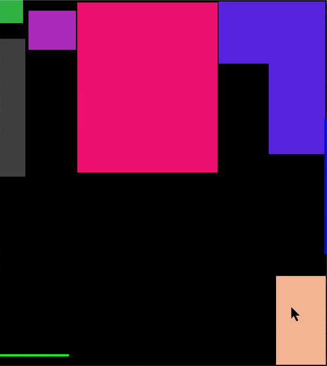

# Room-Layout

This is just a Java Graphics program I made because I wanted to reorder my room. So I coded my room and allowed the furniture to move so I can see all my options. Yes. I'm that guy.

Here's what it looks like:



___

Instructions:
* Move around the furniture by clicking and dragging them 
* Rotate the furniture by clicking and using the scroll wheel 
* Open the door by clicking on it
* Press the 'r' key to restart

I also included optional collisions with other furniture and with the walls. Just play around with these variables in the *__Room.java__* file:
```java
private boolean checkForFurnitureCollisions = false; // check for collisions between furniture
private boolean checkForBorderCollisions = false; // check for collisions with walls
```

To add furniture, just add the *x* and *y* (in inches, relative to the top left corner of your room) for each vertex of the piece of furniture to these arrays in the *initRoom()* method in the *__RoomManager.java__* file:
```java
float[][] x = { { 33.5f, 94.5f, 94.5f, 33.5f }, // bed
        { 95, 141.25f, 141.25f, 116.75f, 116.75f, 95 }, // desk
        { 120, 141.5f, 141.5f, 120 }, // shelf
        { 12.25f, 33, 33, 12.25f }, // bedside table
        { 0, 10, 10, 0 }, // lamp
};
float[][] y = { { 1, 1, 75, 75 }, // bed
        { 0.5f, 0.5f, 67, 67, 27.5f, 27.5f }, // desk
        { 120, 120, 158.5f, 158.5f }, // shelf
        { 4.5f, 4.5f, 21.5f, 21.5f }, // bedside table
        { 0, 0, 10, 10 }, // lamp
};
```
The unit of measurement is in inches. Add your things in inches. The scaling is taken care of in *__Room.java__*.